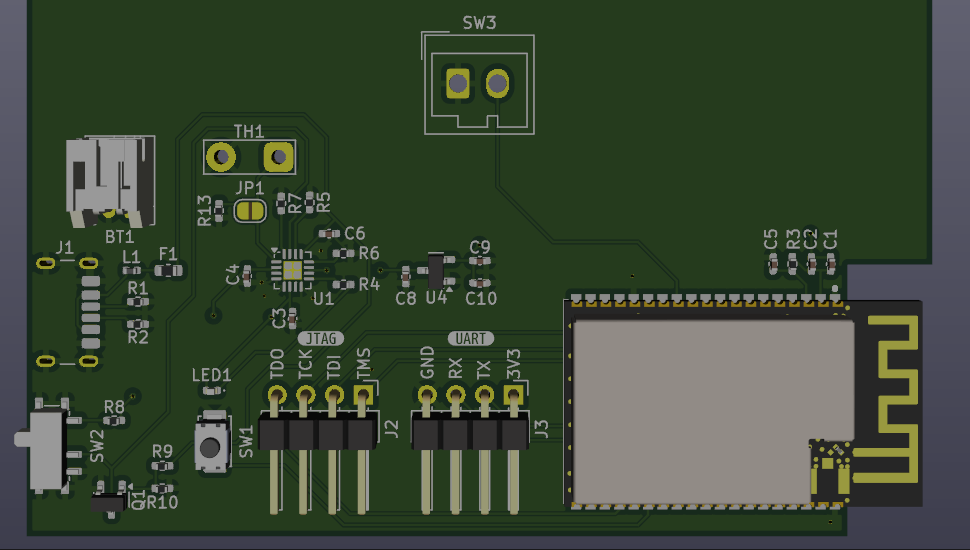
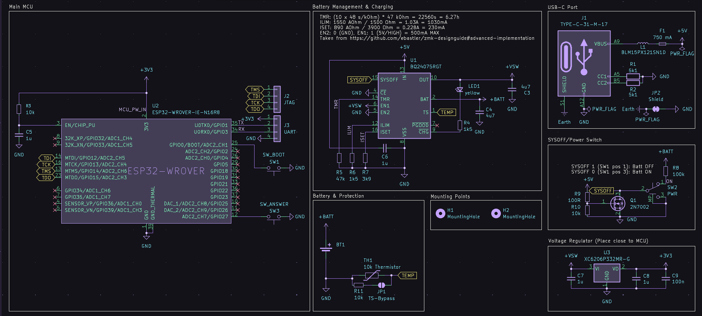

# Before June 14th: The design ideas

I got the basic design constraints from my school's IT department (consisting of a single guy), since they're going to be actually using this system:

> rechargable 18650 (usb best)
> In a small module with a large button
> Renamable teams
> Up to 16 buttons
> Big buttons
> Large LED light on receiver that displays a colour with the TEAM name/number
> Buttons must be accurate to 10ms
> So some form of time sync with the receiver acting on the earliest button pressed after a 2 second wait.

Using this, I kinda refined down to this:
The buttons
  - ESP32-WROVER-IE-N16R8 module
    - Might use an S2 for usb... hmm
  - Custom PCB to make it easier to solder and layout in the custom enclosure + charging controller
    - rechargable 18650 LiPO
  - Custom enclosure
    - Large button (for resetting after somebody answered)
- The receiver
  - Custom PCB
    - ESP32-WROVER-IE-N16R8 module
    - LCD (will have to research and pick an appropriate one)
    - RGB LED (either 1 or a grid for an extra bright light)
    - Charging controller
    - rechargable 18650 LiPO
  - Custom enclosure
    - Large button (so you can actually answer)

**Total time spent: not counted**

# June 14th: Further part picking and initial schematic design

## Logfile
- STM32 hunting
  - I was told about the potential of using an STM32 module for the buttons, since they are more efficient and smaller. Checking the available options rn
    - Go go gadget https://www.robotics.org.za/index.php?route=product/search&search=stm32
    - ...none of their options have wireless sob
    - I think I'll go with the ESP32-WROVER-IE-N16R8 module for now, since it's more versatile + still really cheap for me (R55 for a module)
- Designing the Button: PCB Schematic
  - 14:00 KiCAD time. Haven't used this in a while
  - 14:37 JTAG is confusing. Time to ask HC
    - 14:43 ok JTAG is now less confusing
      - Also looks like I can use my RPI4b to just bitbang the GPIOs to act as a programmer. Neat.
  - 14:50 https://dubiouscreations.com/2021/04/06/designing-with-usb-c-lessons-learned/ useful for USB C power
  - 14:58 Been working kinda slowly, but I'm getting there
  - 15:02 Going to try use https://www.ti.com/lit/ds/symlink/bq24075.pdf for the charging controller.
    - Used it before. It's simple enough to use, and it's cheap.
  - 15:10 https://github.com/ebastler/zmk-designguide/tree/main using this as a starting point for the battery design
  - 15:20 ...wait I need to convert the 5V input to 3.3V
    - The ESP32-WROVER uses 3.3V for power
    - Looking at the design guide, looks like an XC6206P-series regulator will work
  - 15:52 to save costs, I think I'm gonna move to a TP4056 for charging
    - There's so many extra components and setup required for the BQ24075 :c
  - 16:15 calling it quits here for today. Got quite a bit of work done for now

## Journal entry
So, I spent a bunch of time looking at components (Mostly from https://www.robotics.org.za/), reading datasheets (mostly the BQ24075 and ESP32-WROVER datasheets), and reference schematics (ty https://github.com/ebastler/zmk-designguide)

### Button Schematic
Most of my time today was spent between this and datasheets.

The ESP32-WROVER is where I started, and ended up looking like this:

_So many ports..._

Fairly standard currently, although the CHIP_PU needs to be investigated on how tf I use it with my current setup. I also need to actually connect the main big button somewhere, or provide a breakout in case I mount
the button directly to the case and just wire it to the board.

Next up: USB. Since the WROVER doesn't have USB-OTG, I can't actually use the data lines for programming. So I chose a TYPE-C-31-M-17 connector, which is a power-only connector. I also copied my USB design from the [woagboard](https://github.com/Suya1671/woagboard), since USB C power is USB C power, and I already read a bit of the USB spec for that project already.

_Turns out: USB C power is not that bad!_

Next up: Power. Oh god... Power... I did not have a fun time making this part.

Firstly, most of the design is directly taken from the zmk designguide. Secondly, I had to do a lot of research on how to see if I should use the BQ24075 (which I am familiar with) or the TP4056 (which I am not familiar with, but has fewer passives and fewer features). The main things that made me chose the BQ24075 is that it can be used while charging (nice for testing), has an easier-to-read datasheet (me being lazy), and the SYSOFF feature (allows the device to be charged while turned off).

_Pain and suffering: the schematic_

Since I plan to use raw 18650 cells, I also needed extra protection against overcurrent and overvoltage. Basing off the ZMK designguide, I used the DW01A. I made a nearly 1:1 copy of it's application reference schematic and connected it up to the correct labels

_Yes it's a bit cramped, but it works™️_

The SYSOFF part of the schematic I don't fully get and I think I also need to intergrate it with the CHIP_PU pin, so take this as a "it's here for reference" image

_"What the hell is this?" - Dante_

You might have noticed: this entire power circuit is running on 5V, not 3.3V. And the MCU requires 3.3V... Regulator time! I took this from the holyiot module schematic from the designguide, and also have not fully looked into the schematic. Another future me issue. Again, take this as a "it's here for reference" image. I have no idea how a voltage regulator works, so that's also a future me issue.

_Wait how does it even go from 5V -> 3.3V? Resistors? But that would be wasteful..._

**Total time spent: 2 hours**

# June 16th: More schematic work

## Logfile
- 09:25 Time to get to work
  - 09:32 Redoing BQ24075 rn
  - 10:39 Redid the entire schematic. Looks quite a bit nicer now I think
  - 11:02 Thermistors are annoying to find. Adding a bypass to the schematic
  - 12:02 Been working on footprints, cleaning up the schematic, etc.

## Journal Entry

I nearly finished the schematic I think! Just need to add the points for the actual button (once I figure out exactly what button I'm using), and then I can start working on the PCB layout.

_It's beautiful. I've looked at it for 5 hours now._

(Well, I was actually looking mostly at various datasheets and reference designs for 4 hours, but you get the idea this was actually such a time drain.)

Some notable changes
- I figured out how the CHIP-PU works
  - Needs a slight bit of delay to get working apparently. I just added that with recommended values from the datasheet
- I completely redid the battery management and protection circuits
  - They look so much better now aaaaaaaaaaa
  - Also I added a thermistor bypass to the protection circuit, in case I can't find a suitable one.
    - Taken inspiration from SparkFun Battery Babysitter
  - I also fixed 2 short circuits. Oops.

Also: footprints! I finally filled in all footprints for all components. I'm using 0402 for passives (might replace with 0603s for ease of replacement). I also made a couple of my own for components that didn't have nice existing ones

Norrex 18650 SMD battery holder:

_18650 good and best_

TS-1088-AR02016 button:

_Cheapest button on JLCPCB that doesn't look bad._

Next up: the PCB layout

_Looks like I have my work cut out for me_

**Total time spent: 4 hours**

# June 22nd: Schematic simplification and PCB design

## Logfile
- 11:52 Time to get to work
  - New requirements have been given
    - yeet the 18650 for a pouch battery
      - This allows me to remove a bunch of components. Yay!
    - Button will be wired up through just 2 wires. I should probably just add through holes to solder to the PCB.
    - PCB needs to fit in an 80x80mm area
  - 12:11 Oops
    - 
  - 12:39 news just in: Connecting the answer button via a WAGO connector. Nice that KiCAD already has footprints for that

## Journal Entry
After discussing with my school's IT department (consisting of a single guy), we realised space would be a bit more limited and pouch batteries would be better than 18650s. The new design will also attach to the bottom of the existing school buttons, which are ~80x80mm (Don't have pictures on hand :c). This means I could remove a lot of the protection circuitry pouch batteries already come with.

_Who needs an on-board BMS when your battery already has one_

I've also been routing the MCU traces and footprints. So far, it seems pretty good, although I'll probably be revising this bit a lot. I'm not super happy with the JTAG connector rn and I still need to go through the UART. USB looks alright I think.

_Yeah some of these traces do be funky_

The power switch and USB C port are going to be interesting to try intergrate into the casing. Also will have to makes sure I don't mess up the decoupling capacitors in the future. Next up: Power Layout.

_So I heard you liked passive components_

**Total time spent: 2 hours**

# June 23rd: PCB design (maybe) done for the button!

I finally finished the PCB design! It was an actual nightmare routing some of these power traces. Constant conflicts, traces going over other traces, grounding issues, wire spacing, etc.
But I managed to get it done after a lot of careful movement and adjustments.

_This had 6 complete redos. **6 complete retracing and repositions.**_

Small rant: the pin layout for the BQ24075 absolutely sucks. Some of the ground and +VSW pin placements force them to crossover unless you via them. This is annoying when I want to try minimise the use of the bottom layer for a continuous ground plane. the ISET and TMR pins being around the SYSOFF pin also made that a nightmare to handle without issues

Some of the traces are also a bit... unorthodox.

_When you need the smallest path for a decoupling capacitor, you will do cursed stuff to get there_

_...You know this looks less bad than I expected_

**Total time spent: 3 hours**

Next up: Double checking the PCB and BOM creation

# June 26th: Final Checks, finishing touches, and the BOM for the button

I spent quite a bit of time going over ERC violations in my schematic. Turns out, power symbols mean nothing*.

*Except PWR_FLAG, which tells KiCAD where power comes from if it itself can't figure it out.

The following changes were made:
- Adding PWR_FLAG to places where it makes sense to
- Splitting SHIELD and GND, and then connecting both together through a small channel (This is recommended USB practice)
- Adding mounting hole footprints
- Redoing the voltage regulator schematic
- Relabeling all components

_It's done. Finally._

The PCB also got some updates:
- Added mounting holes.
    - IT guy said they _probably_ won't be used, but I'm keeping them in case
- Rounded the corners.
    - It just... looks better lol
- Moved the LDO closer to the MCU
    - This helps with EMI. Also allows me to remove a couple of capacitors. It does look kinda cursed though
- New WAGO footprint
    - The one I was using was for a block, not the clamp system. Oops
- [Melted the traces](https://www.youtube.com/watch?v=euJgtLcWWyo)
    - Also teardropped the vias and pads
- Added BOM tags through the JLCPCB plugin
    - This also required some size adjusting, increasing some components from 0402s to 0603s for cheaper components

_Holy rounded tracks, batman!!_

The BOM + PCBA comes out to ~$60, which is great! This excludes the MCUs and Batteries though, which adds ~R700 (~$40).
This leaves $50 for the central module... _Should_ be doable.

**Total time spent: 4 hours**
